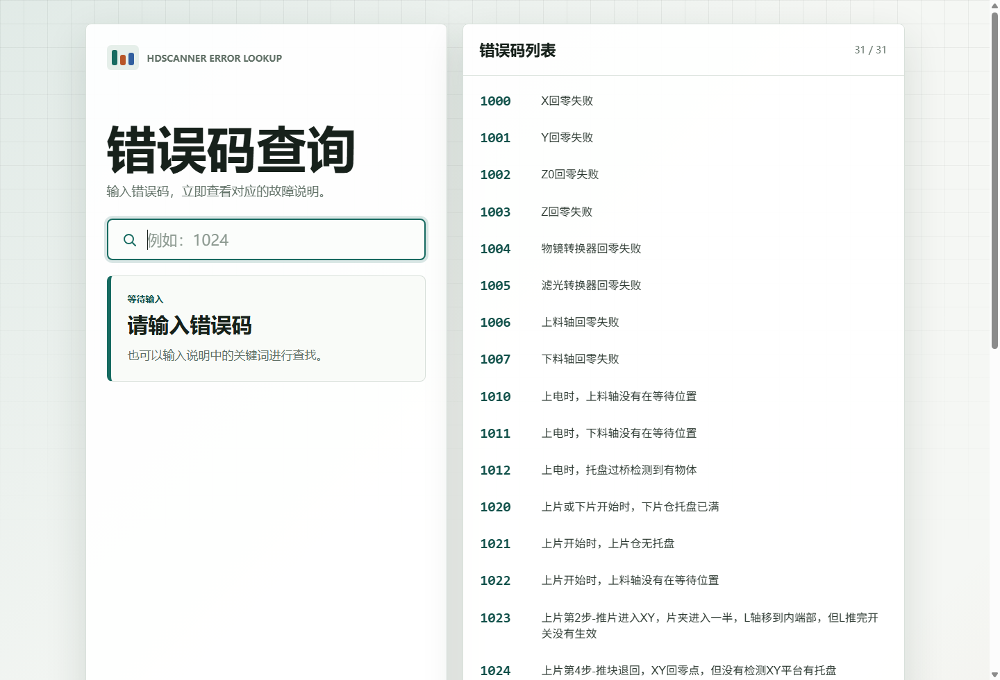

# HDS Error Lookup

面向 HDSCANNER 病理切片扫描软件的错误码查询网站。用户输入扫描软件返回的错误码后，可以快速查看对应的中文故障说明；也支持输入说明关键词进行筛选。

线上地址：[https://hds-error.vercel.app](https://hds-error.vercel.app)



## 功能

- 错误码精确查询，例如输入 `1024` 返回对应故障说明
- 中文关键词搜索，适合不确定错误码时快速定位
- 右侧完整错误码列表，可点击条目快速查看
- 数据优先从 `错误码.txt` 读取，并在前端内置兜底数据
- 纯静态 HTML/CSS/JavaScript 实现，可直接部署到 Vercel

## 项目结构

```text
.
├── index.html
├── styles.css
├── app.js
├── 错误码.txt
├── vercel.json
└── docs/
    └── screenshots/
        └── hds-error-home.png
```

## 本地运行

直接打开 `index.html` 即可使用。也可以启动本地静态服务：

```powershell
node server.js
```

然后访问：

```text
http://127.0.0.1:4173/
```

## 部署

该项目已部署在 Vercel：

[https://hds-error.vercel.app](https://hds-error.vercel.app)

如果重新部署，在 Vercel 新建项目时选择该仓库，框架选择 `Other`，构建命令留空，输出目录留空即可。
